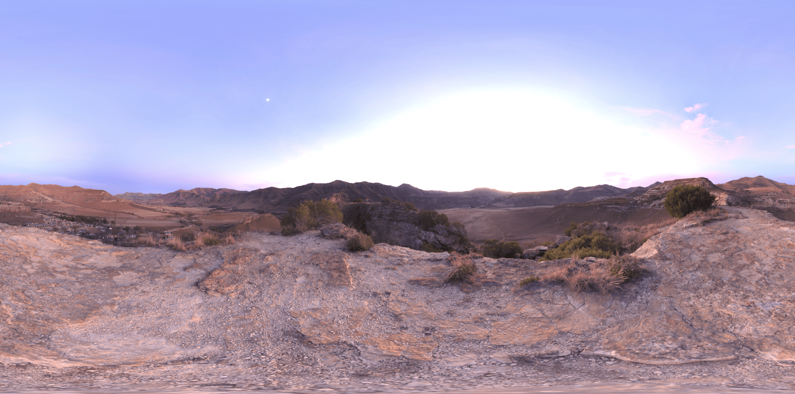

# Additional resources for Rendu

Additional scenes for the Rendu graphics experimentation engine ([repository](https://github.com/kosua20/Rendu)). Scenes are using a *1 unit = 1 meter* scale (approx.).

Avoid cloning this repository, instead just download the archive version and unzip it in the Rendu files tree, at `resources/additional/`.

Add the following line in the initialisation of the projects you want to make the data available to.

	Resources::manager().addResources("../../../resources/additional");

# Scenes

### Living Room

*The White Room*, Jay-Artist, [Blendswap](https://www.blendswap.com/blends/view/41683)

Export: Benedikt Bitterli, Rendering resources [[1]][bbpage]

Converted to OBJ by Nicholas Hull at NVIDIA, with materials corrected by Morgan McGuire at Williams College to match Bitterli's reference images [[2]][mgpage]

License: CC-BY-3 [[3]][ccpage]

### Sponza

*Crytek Sponza*, Frank Meinl.

Converted version: Morgan McGuire [[2]][mgpage]

License: CC-BY-3 [[3]][ccpage]

### Fireplace

*The Grey & White Room*, Wig42, [Blendswap](https://www.blendswap.com/blends/view/75795)

Export: Benedikt Bitterli, Rendering resources [[1]][bbpage]

Converted to OBJ by Nicholas Hull at NVIDIA, with materials corrected by Morgan McGuire at Williams College to match Bitterli's reference images [[2]][mgpage]

License: CC-BY-3 [[3]][ccpage]

### Staircase

*Modern hall*, NewSee2l035, [Blendswap](https://blendswap.com/blend/6304)

Export: Benedikt Bitterli, Rendering resources [[1]][bbpage]

License: CC-BY-3 [[3]][ccpage]

### Dragon and monkey

Monkey from Blender, dragon from the Stanford repository, with textures created by Simon Rodriguez. Plane texture from [textures.com](http://textures.com).

### Desk

Models and textures downloaded from SketchFab under Creative Common Attribution License 4.0.

- Desk: sketchfab.com/jesusblasco
- Candlestick: sketchfab.com/FlukierJupiter
- Lighter: sketchfab.com/goswick3
- Screwdriver: sketchfab.com/hansvdz
- Rock: sketchfab.com/quintessenz
- Hammer: sketchfab.com/artssionate
- Spyglass: sketchfab.com/ozhogi

### Spheres

Textures from [textures.com](http://textures.com).

# Environments

### Spruit Sunrise

Greg Zaal, [HDRIHaven](https://hdrihaven.com/hdri/?c=skies&h=spruit_sunrise)

License: CC-0 [[4]][cc0page]

### Venice Dawn

Greg Zaal, [HDRIHaven](https://hdrihaven.com/hdri/?c=skies&h=venice_dawn_1)

License: CC-0 [[4]][cc0page]

### Entrance hall

Sergej Majboroda, [HDRIHaven](https://hdrihaven.com/hdri/?c=indoor&h=entrance_hall)

License: CC-0 [[4]][cc0page]

 
 
### Studio 3 

Greg Zaal, [HDRIHaven](https://hdrihaven.com/hdri/?c=studio&h=studio_small_03)

License: CC-0 [[4]][cc0page]

### Kiara dawn

Greg Zaal, [HDRIHaven](https://hdrihaven.com/hdri/?c=skies&h=kiara_1_dawn)

License: CC-0 [[4]][cc0page]

[bbpage]: https://benedikt-bitterli.me/resources/ "Benedikt Bitterli Rendering resources"

[mgpage]: https://casual-effects.com/data "Morgan McGuire's Computer Graphics Archive"

[ccpage]: https://creativecommons.org/licenses/by/3.0/ "Creative Commons "

[cc0page]: https://creativecommons.org/publicdomain/zero/1.0/ "CC0"